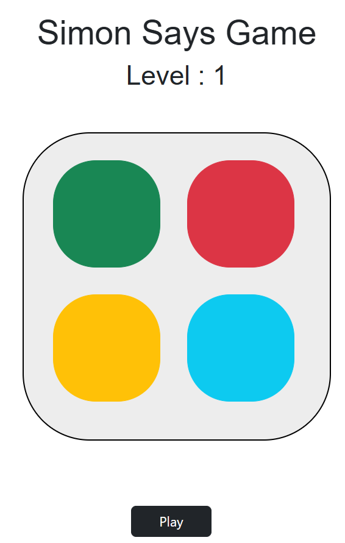

# 🎮 Simon Says Game

A fun and interactive Simon Says memory game built using HTML, CSS, and JavaScript. The game challenges users to remember and repeat an increasing sequence of colors.

---

## 🚀 Features

* Interactive gameplay with color buttons
* Random sequence generation
* Increasing difficulty with each level
* User input validation
* Visual feedback for correct and wrong moves

---

## 🛠️ Tech Stack

* HTML5
* CSS3
* JavaScript (Vanilla JS)

---

## 📂 Project Structure

* index.html
* style.css
* script.js

---

## 💡 How It Works

* The game starts by showing a random color sequence
* The user repeats the sequence by clicking buttons
* Each correct round adds a new step to the sequence
* Game ends when the user makes a wrong move

---

## 🎯 Game Logic

* JavaScript generates a random sequence
* User input is stored and compared with the sequence
* If matched → next level
* If not → game over

---

## 📸 Screenshots

---

## 📌 Future Improvements

* Add sound effects
* Add score tracking
* Add difficulty levels
* Improve animations

---

## 🙌 What I Learned

* DOM manipulation
* Event handling
* Game logic implementation
* Working with arrays and conditions

---

## 📃 License

This project is created for learning purposes.

